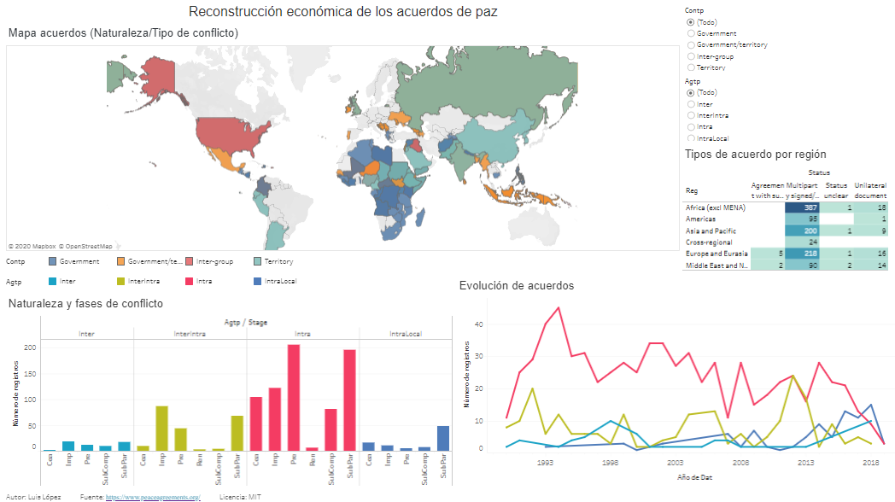

# Reconstrucción económica de los acuerdos de paz

En este informe mostraremos el proceso de realización de una visualización a partir de los datos obtenidos de la base de datos de la universidad de Edinburgh (https://www.peaceagreements.org/search) sobre acuerdos de paz en todo el mundo desde el 1990.

# Visualización de datos

La visualización de datos se publica en [Tableau Public](https://public.tableau.com/shared/YKCHNS7Y4?:display_count=y&:origin=viz_share_link) y nos permite comparar los datos, localizarlos, o detectar posibles patrones en relación a los acuerdos de reconstrucción socioeconómica de las diferentes regiones a los acuerdos de paz, según la fase, el tipo o la naturaleza de conflicto, llegando a a ser útil a los integrantes del proyecto o stakeholders para la toma de decisiones.

# Datos

El conjunto de datos es parte de la Base de datos de acuerdos de paz y contiene información sobre los acuerdos de paz firmados en todo el mundo desde 1990.

La carpeta de [datos](./datos) contiene todos los archivos utilizados para construir la visualización de datos:

* [pax_data_933_agreements_14-04-20.csv](./datos/pax_data_933_agreements_14-04-20.csv) - Datos originales del proyecto de acuerdos de paz en formato csv
* [pax_data_933_agreements_14-04-20.xlsx](./datos/pax_data_933_agreements_14-04-20.xlsx) - Datos originales del proyecto de acuerdos de paz en formato csv
* [pax_data_933_agreements_08-05-20_modificado.xlsx](./datos/pax_data_933_agreements_08-05-20_modificado.xlsx) : datos transformados utilizados en la visualización

# Documentos

El proceso de creación de la visualización se detalla en la carpeta de [documentos](./documentos) :

* [PAC2](./documentos/PEC2-luilop.pdf) - Exploración del conjunto de datos
* [PAC3](./documentos/PEC3-luilop.pdf) - Informe de visualización
* [PAC4](./documentos/PEC4-luilop.pdf) - Presentación de visualización

# Referencias

[1] BELL, C.; BADANJAK, S.; FORSTER, R.; JAMAR, A.; MOLLOY, S.;MCNICHOLL, K.; NASH, K.; POSPISIL, J.; WISE, L (2019). PA-X Peace Agreements Database and Dataset, Version 3. Political Settlements Research Programme, University of Edinburgh, Edinburgh. [online] Disponible en: https://www.peaceagreements.org/

[2] Nathan Yau , Visualize This: The FlowingData Guide to Design, Visualization, and Statistics, Ed. FlowingData , 2011.

[3] Gencat (2019). Guía de visualización de datos [online] Disponible en: http://atenciociutadana.gencat.cat/web/.content/manuals/visualitzacio_dades/guia_visualitzacio_es.pdf

----

Este trabajo está bajo una licencia [MIT](./LICENSE)
